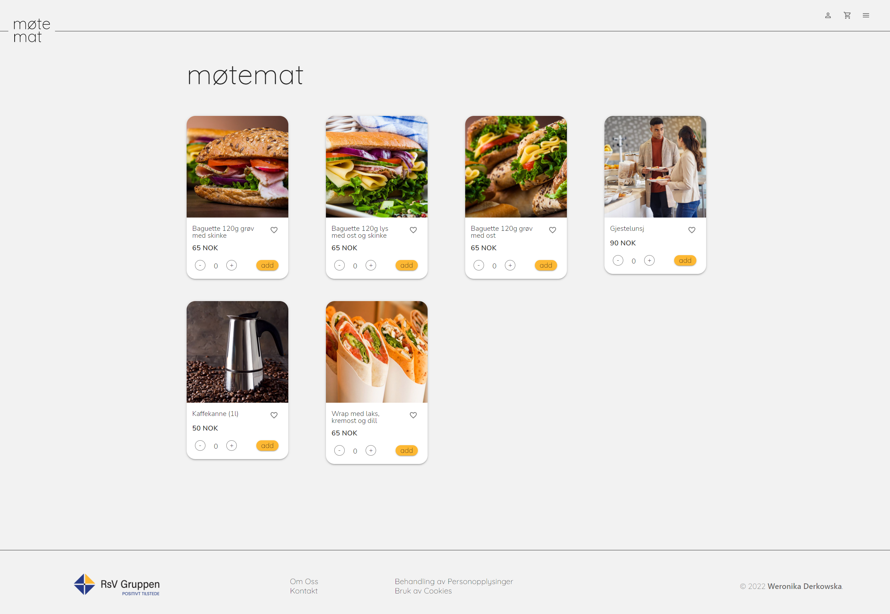

# Project Exam 2
## Front-end Development 2nd Year



During this project we had a choice beetween Social Media website for our students (API delivered by Noroff) or Real Lice Client Project that will fulfill requirements. I picked 2nd option. 
This project is an answear to request for a food-order solution. Customer have few Canteen for different clients and would like to offer them unifyed way of ordering baguetts, coffe and so for meetings, courses, lunch guests. 

## Functional Specification

[Detailed specification](https://oasis-toad-793.notion.site/Functional-Specification-c49efab21c934590aa26867f370db290) 

## Design Prototype

[Prototype - Adobe](https://xd.adobe.com/view/ea66ca99-13eb-4334-84d5-8e8a0c31ef4e-bf35/)

## Used Technologies

- React (+npm packeges: react-dom, react-hook-form, react-router-dom)
- Mui
- SCSS
- npm package YUP for form validation

### Installing

1. Clone the repo:

```bash
git clone https://github.com/Noroff-FEU-Assignments/project-exam-2-werodev.git
```

2. Install the dependencies:

```
npm install
```

### Running

```
npm start
```

## Contact

[My LinkedIn page](https://www.linkedin.com/in/weronika-derkowska-a00459179/)
